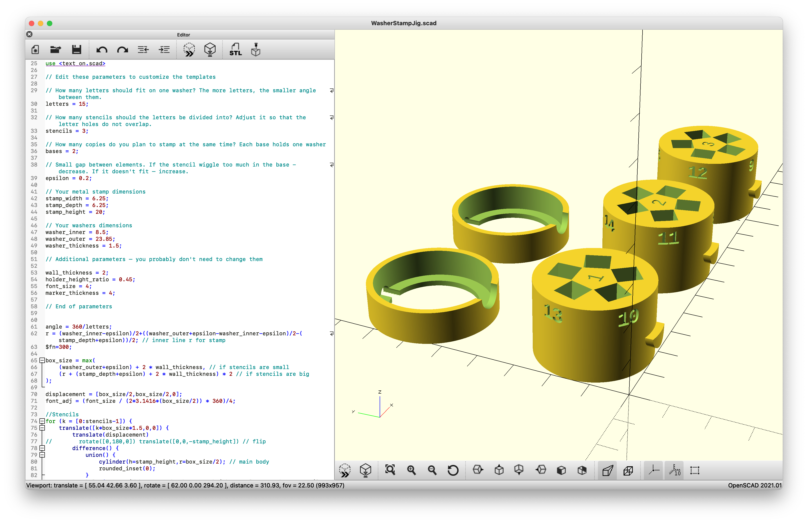

# WasherStampJig
DYI Printable 3D Template for Stamping Metal Washers - Cheap and secure Cold Storage for backing up your passwords and cryptocurrency seeds

## The idea

To backup your sensitive data – stamp them on metal washers.  
This printable jig will allow you to align any letter stamps on any washers neatly.

Read more about the original idea of stamping washers: https://safu.ninja/  
Check out the [stress test/review](https://jlopp.github.io/metal-bitcoin-storage-reviews/reviews/safu-ninja/) and [comparison](https://jlopp.github.io/metal-bitcoin-storage-reviews/) to other solutions by Jameson Lopp.

## How to

### You'll need:
* Access to 3D printer 
* Metal stamps
* Metal washers
* Caliper
* Hammer
* Small anvil or any block/plate of metal
* Some tape - e.g. duct tape
* Marker pen

### Instructions:
1. Download files to a folder:
    * WasherStampJig.scad
    * text_on.scad
    * text_on_cylinder.scad
1. Customize and generate the model in OpenSCAD:
    1. Install [OpenSCAD](https://openscad.org/) software 
    1. Open WasherStampJig.scad
    1. Measure your washers and stamps
    1. Adjust the parameters to your needs – washer and stamp sizes, etc.
    1. Render the objects, generate STL file and print it in 3D
1. Prepare the base(s) – use two or more to create duplicates for backup purposes
    1. Put a piece of tape on flat surface
    1. Put the base on the tape so it stick from the bottom
    1. Put the washer in the hole in the base so it sticks to the tape
    1. Mark the washer side with a marker through the notch in the base side (so you can reposition it correctly in case it falls out in the middle of stamping)
1. Prepare the stencils:
    1. Write down all the words you wish to stamp in a table – put each word in a separate row, each letter in a separate column and number the columns
    1. Put the stamps for the first word in proper holes of the stencils - refer to the letter/column numbers in the table
1. Put the stencil in the base (so it sits on top of the washer) and hit the stamps with a hammer to stamp the letters – repeat for each stencil, base and word

## Why this?

### Customizability
You can easily adjust the jig to fit **any stamps** and any **any washers**. You can also adjust margins, height, font size etc.

### Usability and time savings
The design **saves you time** and makes it **easier** to create **multiple copies** of stamps.

Since the template for each stamp is broken into multiple stencils (to accomodate narrow angles between each stamp) – all of the letters of a word can be prepared in batch, at the same time.  
Then you can proceed to stamp all of them at once - on one or more washers (each taped to its own base).

This dramatically improves time needed to stamp multiple washers (in multiple copies) and reduces mistakes as compared to alternative solutions (which usually force you to stamp each letter separately).

Please see other implementations of the same idea to compare:
* [Blockmit Washer Jig](https://estudiobitcoin.com/fabrica-tu-billetera-fria-con-arandelas/)
* [Keytala Jig](https://www.hardwarewallet.it/en/keytala-jig/)

## Help needed

Contact me: mahzhoor@protonmail.com

## Support
If you have any **questions or suggestions** to the design or the (ugly!) code – please reach out to me at: Contact me: mahzhoor@protonmail.com

In case you've successfully used it – please **share** some **photos** and the **parameters** you used for the setup!

## Acknowledgements
* The code uses [text_on_OpenSCAD](https://github.com/brodykenrick/text_on_OpenSCAD) – library by [Brody Kenrick](https://github.com/brodykenrick) used for generating letters in OpenSCAD